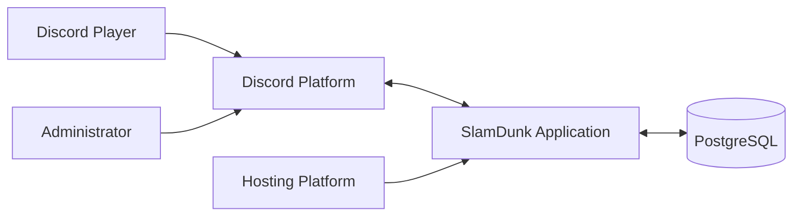

# 01 — System Context

> **Project:** SlamDunk  
> **Architecture Style:** Modular Monolith  
> **Primary Runtime:** Node.js  
> **Discord SDK:** discord.js  
> **Primary Database:** PostgreSQL  
> **Status:** Architecture Baseline

---

## 1. Purpose

This document defines the external context of SlamDunk: who interacts with the system, which external systems are involved, what is inside the SlamDunk application boundary, and what architectural constraints apply.

This document does **not** define detailed business logic or database columns. Those are covered by later architecture documents.

---

## 2. System Overview

SlamDunk is a Discord-based basketball collectible card game.

Players interact with the game through Discord slash commands, buttons, selects, and other Discord interactions.

High-level flow:

```text
Discord User
    ↓
Discord Platform
    ↓
SlamDunk Bot
    ↓
Application / Domain Services
    ↓
Repositories
    ↓
PostgreSQL
```

The Discord interface is an adapter to the game application. Core game rules must not be implemented directly inside Discord command handlers.

---

## 3. System Boundary

The following components are **inside** the SlamDunk system boundary:

```text
SlamDunk Application
├── Discord Interaction Layer
├── Application / Domain Services
├── Game Modules
├── Repository Layer
├── Database Access
├── Game Configuration
├── Logging / Error Handling
└── Scheduled / Maintenance Jobs
```

The following are **outside** the SlamDunk system boundary:

```text
Discord Platform
Discord Users
PostgreSQL Server
Deployment / Hosting Platform
External Monitoring Platform (future)
External Asset Storage / CDN (future)
```

---

## 4. Primary Actors

### 4.1 Player

A Discord user who interacts with SlamDunk.

Typical actions:

```text
/profile
/claim
/daily
/pack
/collection
/card
/lineup
/challenge-ai
/quicksell
/upgrade
/market
/sell
/buy
/trade
```

A Player may:

- own Card Instances;
- own Gold and Shards;
- create a lineup;
- participate in battles;
- list cards on Market;
- buy listed cards;
- directly trade with another player;
- fuse duplicate cards;
- use Upgrade Items.

---

### 4.2 Administrator

A trusted operator of SlamDunk.

Potential responsibilities:

- inspect players;
- inspect transactions;
- correct invalid data;
- manage Card Templates;
- manage pack configuration;
- manage rarity weights;
- disable problematic content;
- investigate exploits;
- inspect audit logs.

Administrator features are not part of the first playable MVP unless explicitly added later.

---

## 5. External Systems

### 5.1 Discord Platform

Discord is the primary user interface.

SlamDunk depends on Discord for:

- user identity;
- slash commands;
- interaction events;
- buttons and select menus;
- message/embed rendering;
- guild context.

Discord is **not** the source of truth for game data.

The database remains authoritative for:

```text
Player Account
Wallet
Cooldown
Cards
Ownership
Lineup
Market
Trade
Battle Records
Transactions
```

---

### 5.2 PostgreSQL

PostgreSQL is the authoritative persistence layer.

It stores:

- game state;
- card ownership;
- economy state;
- immutable transaction records;
- market listings;
- trade state;
- card lifecycle history;
- battle data;
- configuration references where appropriate.

PostgreSQL transactions and constraints are used to protect game economy integrity.

---

### 5.3 Deployment Platform

Hosting provider is **TBD**.

Architecture must not depend on a provider-specific feature unless documented later.

The application should be deployable as a standard Node.js process with:

```text
Environment Variables
PostgreSQL Connection
Discord Bot Token
Application Configuration
```

---

## 6. External Context Diagram



---

## 7. Core Architectural Constraints

### 7.1 Modular Monolith

SlamDunk starts as one deployable application.

```text
One Application
One Main Database
Multiple Internal Modules
```

No microservices are required for the MVP.

---

### 7.2 Layered Dependency Flow

Primary request path:

```text
Discord Interaction
        ↓
Command / Interaction Handler
        ↓
Application Service
        ↓
Domain Module
        ↓
Repository
        ↓
PostgreSQL
```

Higher layers may depend on lower abstractions.

Lower layers must not depend on Discord-specific code.

---

### 7.3 Database Is Source of Truth

Game-changing actions must not depend on:

- in-memory-only state;
- Discord message history;
- Discord timestamps as authoritative cooldown data.

Important state must be persisted.

---

### 7.4 Economy Operations Must Be Atomic

Operations that move currency, ownership, or destroy/create valuable Card Instances must use database transactions.

Examples:

```text
Market Purchase
Direct Trade
Card Fusion
Quicksell
Paid Pack Purchase
Upgrade Item Consumption
```

---

### 7.5 Card Identity Is Persistent

Each Card Instance has a unique identity.

Destroyed cards remain in the database for audit/history purposes.

Serial numbers are never reused.

---

## 8. Current Product Decisions Affecting Architecture

The architecture assumes:

```text
Card OVR range: 60–99
8 base card stats
7 rarity tiers for first MVP
Top rarity: Hall of Fame
Traits fixed by Card Template
Trait tiers fixed by Card Template
Trait tiers use I / II / III
Initial Card Level: random 1–5
Maximum Card Level: 5
Fusion result level = min(level A + level B, 5)
Fusion destroys both source Card Instances
Fusion creates a new Card Instance with a new serial
Upgrade Item adds +1 Level, capped at 5
Fixed-price Market
Direct Trade
0% Market fee
0% Trade fee
0 Gold Upgrade fee
```

---

## 9. Current TBD Decisions

Architecture must remain flexible for:

```text
Final rarity probabilities
Hard circulation caps
Exact Trait coefficients
Pack cooldown
Pack reveal rules
Pack timeout behavior
Paid pack structure
Daily rewards
Quicksell values
Additional Gold sinks
Listed-card battle eligibility
Maximum cards per direct trade
Battle simulation depth
Fatigue
Substitutions
PvP mode
Battle rewards
```

These are product/balance decisions and should not require a major architectural redesign.

Provisional inputs for simulation and playtesting are recorded in
[`docs/requirements/economy-pack-baseline.md`](../requirements/economy-pack-baseline.md).
They do not convert these TBD items into final architecture requirements.

---

## 10. Non-Goals for Initial Architecture

The first architecture does not require:

- microservices;
- event streaming infrastructure;
- distributed cache;
- separate battle server;
- real-time socket API outside Discord;
- blockchain/NFT ownership;
- auction marketplace;
- multi-region deployment.

These may be reconsidered only when real scale or requirements justify them.
