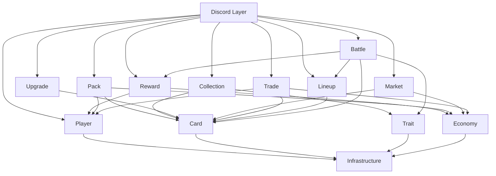

# 03 — Domain Modules

> **Project:** SlamDunk  
> **Architecture:** Modular Monolith  
> **Purpose:** Define module responsibilities, boundaries, and dependencies.

---

## 1. Module Design Principles

Each domain module owns a clear business responsibility.

A module should expose behavior through services rather than allowing other modules to modify its persistence directly.

Example:

```text
MarketService
    ↓
CardService.transferOwnership(...)
```

Preferred over:

```text
MarketService
    ↓
CardRepository.updateOwner(...) directly
```

for business-critical ownership changes.

---

## 2. Initial Module Map

```text
Player
Economy
Card
Trait
Pack
Reward
Collection
Upgrade
Market
Trade
Lineup
Battle
Shared / Infrastructure
```

---

## 3. Player Module

### Responsibility

Own the SlamDunk player account.

### Main Data

```text
Player
Player Progression
Player Cooldown References
```

### Main Operations

```text
createPlayer()
getPlayer()
getOrCreatePlayer()
updateLastActive()
addXP()
recordWin()
recordLoss()
```

### Does Not Own

```text
Gold/Shards → Economy
Cards → Card
Lineup → Lineup
```

---

## 4. Economy Module

### Responsibility

Own Gold/Shards balances and transaction history.

### Main Data

```text
Wallet
EconomyTransaction
```

### Main Operations

```text
getBalance()
credit()
debit()
transfer()
assertSufficientBalance()
```

### Rules

Every currency movement creates an immutable EconomyTransaction.

No business module should directly update wallet balances.

Examples:

```text
PackService → EconomyService.debit(...)
MarketService → EconomyService.transfer(...)
RewardService → EconomyService.credit(...)
```

---

## 5. Card Module

### Responsibility

Own Card Template, Card Instance, serial identity, ownership, and card lifecycle state.

### Main Data

```text
CardTemplate
CardInstance
CardOwnershipHistory
CardSerialSequence / mint counter
```

### Main Operations

```text
getTemplate()
getInstance()
mintCard()
transferOwnership()
lockCard()
unlockCard()
destroyForFusion()
destroyForQuicksell()
validateOwnership()
```

### Card Template Owns

```text
player identity
rarity
base stats
positions
traits
trait tiers
```

### Card Instance Owns

```text
owner
serial number
card level
status
games played
obtained method
ownership lifecycle
```

---

## 6. Trait Module

### Responsibility

Define available Trait mechanics and resolve Trait effects.

### Main Data

```text
TraitDefinition
CardTemplateTrait
TraitTier
```

### Main Operations

```text
getTraitsForTemplate()
getRelevantTraitsForBattleContext()
calculateTraitModifier()
```

### Rules

Traits are fixed by Card Template.

Card Level does not change Trait identity or Trait Tier.

Trait engine should only evaluate traits relevant to the current battle action.

---

## 7. Drop Module

### Responsibility

Resolve Free Drop eligibility, rarity selection, Card Template candidates,
selection result, and initial Card Level.

### Main Operations

```text
checkDropCooldown()
rollRarity()
selectCandidateTemplates()
createDropOffer()
confirmDropSelection()
rollInitialLevel()
```

### Dependencies

```text
Player
Card
GameConfig
```

### Important Rule

The selected Card Instance is minted only through Card module behavior.

---

## 7.1 Pack Module

### Responsibility

Manage a catalog of paid Pack products keyed by stable Pack code. Each Pack owns
its display name and rarity distribution so future products do not modify the
Standard Pack definition.

The current implementation exposes Pack odds only. Pack purchase, opening,
eligibility, and persistence remain future behavior and must not reuse the Free
Drop session model.

---

## 8. Reward Module

### Responsibility

Handle scheduled/cooldown rewards.

Examples:

```text
/claim
/daily
/weekly
battle rewards
future achievements
```

### Main Operations

```text
claimReward()
dailyReward()
weeklyReward()
grantBattleReward()
```

### Dependencies

```text
Player
Economy
Inventory
GameConfig
```

Reward module does not directly write wallet values.

---

## 9. Collection Module

### Responsibility

Provide collection queries and user-facing collection organization.

### Main Operations

```text
listOwnedCards()
filterCollection()
sortCollection()
getCollectionSummary()
```

### Dependencies

```text
Card
Trait
```

Collection is primarily a query/read module.

It does not own Card Instances.

---

## 10. Upgrade Module

### Responsibility

Handle Card Fusion and Upgrade Item usage.

### Fusion Rule

```text
new_level = min(cardA.level + cardB.level, 5)
```

### Fusion Preconditions

Both cards must:

```text
be ACTIVE
belong to the same owner
use the same Card Template
not be market-locked
not be trade-locked
not already be part of another transaction
```

### Fusion Result

```text
Card A → DESTROYED_FUSION
Card B → DESTROYED_FUSION
New Card Instance → ACTIVE
New serial number
Level = capped sum
obtained_method = FUSION
```

### Upgrade Item Rule

```text
new_level = min(current_level + 1, 5)
```

Upgrade Item does not mint a new Card Instance.

### Dependencies

```text
Card
Inventory/Item (future or minimal MVP implementation)
```

---

## 11. Market Module

### Responsibility

Manage fixed-price listings.

### Main Data

```text
MarketListing
```

### Main Operations

```text
createListing()
cancelListing()
searchListings()
buyListing()
```

### Rules

```text
Market fee = 0%
Listing fee = 0
Seller receives full sale price
```

### Dependencies

```text
Card
Economy
```

Market must not directly mutate Card ownership or Wallet balances outside service boundaries.

---

## 12. Trade Module

### Responsibility

Manage direct Player-to-Player trades.

### Main Data

```text
Trade
TradeParticipant
TradeCard
TradeCurrencyOffer
```

### Main Operations

```text
createTrade()
addCard()
removeCard()
setGoldOffer()
confirmTrade()
cancelTrade()
executeTrade()
```

### Rules

Any change to the offer invalidates previous confirmations.

Execution occurs atomically.

### Dependencies

```text
Card
Economy
Player
```

---

## 13. Lineup Module

### Responsibility

Own active team composition.

### Main Data

```text
Lineup
LineupSlot
```

### Initial Slots

```text
PG
SG
SF
PF
C
```

### Main Operations

```text
setCard()
removeCard()
validateLineup()
getActiveLineup()
```

### Rules

Current draft:

```text
Primary Position → allowed
Secondary Position → allowed
Other Position → not allowed
```

No bench in MVP.

---

## 14. Battle Module

### Responsibility

Simulate basketball games and create battle results.

### Inputs

```text
Lineups
Card Template stats
Card Instance level
Traits
Trait tiers
Matchup context
Controlled RNG
```

### Main Operations

```text
createMatch()
simulateMatch()
simulatePossession()
resolveAction()
resolveRebound()
buildBoxScore()
buildPlayByPlay()
completeMatch()
```

### Dependencies

```text
Lineup
Card
Trait
Reward
```

### Rule

Battle code must not permanently alter Card Template base stats.

Card Level is applied as a runtime battle modifier.

The accepted possession-based target, provisional formulas, deterministic
contract, and future Trait hooks are defined in
[`09-battle-engine.md`](09-battle-engine.md). The current M12 aggregate engine
remains a transitional implementation.

---

## 15. Shared / Infrastructure Module

### Responsibility

Cross-cutting technical concerns.

Examples:

```text
Database connection
Transaction helper
Logger
Error types
Configuration loader
ID generation
Time utilities
Discord response mapping
```

Shared code must not become a dumping ground for domain business logic.

---

## 16. Recommended Dependency Direction



---

## 17. Forbidden Dependency Examples

Avoid:

```text
CardService importing Discord Interaction
EconomyService replying to Discord messages
Repository calling Discord API
BattleService editing PostgreSQL tables directly without repositories
MarketService directly changing wallet columns
TradeService directly changing card owner_id
```

---

## 18. Module Communication Rule

For MVP, modules communicate through in-process service calls.

Example:

```text
MarketService.buyListing()
    ↓
EconomyService.transfer()
    ↓
CardService.transferOwnership()
```

No message broker is required.

If asynchronous domain events are added later, they should be introduced only where necessary.
