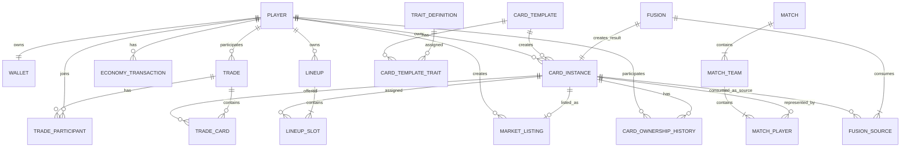

# 04 — Data Model

> **Project:** SlamDunk  
> **Database:** PostgreSQL  
> **Purpose:** Define the conceptual relational data model for the first architecture baseline.

---

## 1. Modeling Principles

The database is the source of truth.

The model should prioritize:

```text
Ownership integrity
Economy integrity
Auditability
Concurrency safety
Clear lifecycle states
Extensibility
```

Do not physically delete valuable historical records when a status transition is sufficient.

---

## 2. Core Entity Groups

```text
Player / Economy
Card / Trait
Pack / Reward
Upgrade / Fusion
Market
Trade
Lineup
Battle
```

---

## 3. Conceptual ERD



---

# 4. Player

Suggested fields:

```text
player_id              PK
discord_user_id        UNIQUE NOT NULL
username_snapshot
player_level
xp
games_played
games_won
games_lost
current_win_streak
highest_win_streak
created_at
last_active_at
```

### Constraints

```text
discord_user_id UNIQUE
player_level >= 1
xp >= 0
```

---

# 5. Wallet

Suggested fields:

```text
player_id              PK, FK → player.player_id
gold_balance
shard_balance
updated_at
```

### Constraints

```text
gold_balance >= 0
shard_balance >= 0
```

Wallet balance is current state.

EconomyTransaction is the audit trail.

---

# 6. EconomyTransaction

Suggested fields:

```text
transaction_id         PK
player_id              FK
currency               GOLD | SHARDS
amount                  signed numeric/integer
transaction_type
reference_type
reference_id
balance_after           optional
created_at
```

Example transaction types:

```text
CLAIM
DAILY
PACK_PURCHASE
MARKET_PURCHASE
MARKET_SALE
DIRECT_TRADE
QUICKSELL
BATTLE_REWARD
ADMIN_ADJUSTMENT
```

Transactions should be immutable.

---

# 7. CardTemplate

Suggested fields:

```text
card_template_id       PK

player_name
edition
season

primary_position
secondary_position

rarity
overall

inside_scoring
mid_range
three_point
playmaking
perimeter_defense
interior_defense
rebounding
athleticism

height
weight

packable
release_date
retired_at

created_at
updated_at
```

### Current Rules

```text
OVR range: 60–99
8 base stats
Multiple editions may exist
```

### Rarity

First MVP has 7 tiers.

Top rarity:

```text
HALL_OF_FAME
```

Final names for all lower tiers should be treated as configuration/product data until finalized.

### M7 Implementation Note

The initial schema stores rarity as numeric `rarity_tier` from 1 through 7 so
Tier 1–6 names can remain configurable. Tier 7 represents `HALL_OF_FAME`.

Height and weight are stored explicitly as `height_cm` and `weight_kg`. Base
stats must be non-negative, but no final game-balance maximum is enforced yet.

---

# 8. TraitDefinition

Suggested fields:

```text
trait_id               PK
trait_code             UNIQUE
trait_name
trait_type
description
active
created_at
updated_at
```

Trait descriptions are maintained independently by SlamDunk.

---

# 9. CardTemplateTrait

Many-to-many relation between CardTemplate and TraitDefinition.

Suggested fields:

```text
card_template_id       FK
trait_id               FK
trait_tier             I | II | III
```

Composite primary key:

```text
(card_template_id, trait_id)
```

Traits and tiers are fixed at Card Template level.

The M7 schema stores `trait_tier` as the numeric value 1, 2, or 3 and maps those
values to the labels I, II, and III. This allows Total Trait Level to be computed
as a direct sum. Provisional rarity Trait Level budgets are not database
constraints because they still require battle simulation and balancing.

---

# 10. CardInstance

Suggested fields:

```text
card_instance_id       PK
card_template_id       FK
owner_player_id        FK nullable for destroyed/system states

serial_number
card_level

status

obtained_method
obtained_at

ownership_cycles
games_played

market_lock            boolean
trade_lock             boolean

created_at
updated_at
```

### Card Level

```text
1 <= card_level <= 5
```

### Status

Recommended lifecycle status:

```text
ACTIVE
DESTROYED_FUSION
DESTROYED_QUICKSELL
```

Market/trade are better represented as locks/relations rather than destructive lifecycle statuses.

### Serial Constraint

Unique per Card Template:

```text
UNIQUE(card_template_id, serial_number)
```

Serial numbers are never reused.

### M8 Implementation Note

Migration `006_create_card_instances.sql` implements `card_instances` with a
unique serial per Card Template, Card Level 1–5, lifecycle status, ownership,
obtain method, and Market/Trade lock flags. Active instances must have an owner.
Destroyed-card and lock state constraints are enforced by PostgreSQL.

---

# 11. CardMintCounter

Recommended helper table or equivalent transactional sequence.

Suggested fields:

```text
card_template_id       PK
last_serial_number
total_minted
current_circulation
updated_at
```

When a new instance is minted:

```text
last_serial_number += 1
total_minted += 1
current_circulation += 1
```

When a card is destroyed:

```text
current_circulation -= 1
```

When Fusion consumes two and creates one:

```text
consume 2 → current_circulation -2
mint 1    → current_circulation +1
net       → -1
```

All counter changes must occur transactionally.

M8 allocates the next serial through an atomic row update in
`card_mint_counters`. Mint counter allocation, Card Instance insertion, and the
initial ownership-history record share one PostgreSQL transaction. Pack-level
idempotency belongs to M9 because a Pack session will own that operation.

---

# 12. CardOwnershipHistory

Suggested fields:

```text
ownership_history_id   PK
card_instance_id       FK

from_player_id         FK nullable
to_player_id           FK nullable

reason
reference_type
reference_id

created_at
```

Reasons:

```text
PACK
MARKET
DIRECT_TRADE
FUSION_CREATED
ADMIN_TRANSFER
```

Destroyed cards are represented by lifecycle status rather than a fake owner.

The M8 mint service writes the initial ownership event for every new Card
Instance. Transfer and destruction operations remain deferred to their own
milestones.

---

# 13. PackSession

M9 implements persisted Free Drop offers with:

```text
pack_session_id
player_id
pack_type
status
created_interaction_id
selected_template_id
result_card_instance_id
completed_at
created_at
updated_at
```

`pack_session_candidates` stores each candidate position, Card Template, and
rolled rarity tier. Candidates are unique within a session, and a partial
unique index permits only one open Free Drop per Player.

An open session has no selected Template or result Card Instance. A completed
session must reference both. This state consistency is enforced by PostgreSQL.
M9 intentionally has no expiration column because Pack timeout behavior remains
TBD; calling `/pack` again reuses the existing open session.

---

# 14. Fusion

Suggested fields:

```text
fusion_id              PK
player_id              FK
result_card_instance_id FK UNIQUE
result_level
created_at
```

---

# 15. FusionSource

Suggested fields:

```text
fusion_id              FK
source_card_instance_id FK UNIQUE
source_level
```

A fusion uses exactly two source cards in the current design.

Business rule:

```text
result_level = min(sourceA.level + sourceB.level, 5)
```

Both source cards must use the same Card Template.

---

# 15. UpgradeItemUsage

If Upgrade Items are implemented as explicit inventory items, use a dedicated item/inventory model.

Minimal audit table:

```text
upgrade_usage_id
player_id
card_instance_id
previous_level
new_level
item_type
created_at
```

Rule:

```text
new_level = min(previous_level + 1, 5)
```

If previous level is already 5, usage must be rejected.

---

# 16. MarketListing

Suggested fields:

```text
listing_id             PK
seller_player_id       FK
card_instance_id       FK
price_gold
status
created_at
sold_at
cancelled_at
buyer_player_id        FK nullable
```

Status:

```text
ACTIVE
SOLD
CANCELLED
EXPIRED   (future)
```

### Constraints

Only one active listing per Card Instance.

Recommended partial unique index:

```text
UNIQUE(card_instance_id)
WHERE status = 'ACTIVE'
```

Rules:

```text
market fee = 0
listing fee = 0
seller receives full price
```

---

# 17. Trade

Suggested fields:

```text
trade_id               PK
status
created_at
updated_at
executed_at
cancelled_at
```

Status:

```text
OPEN
CONFIRMED
COMPLETED
CANCELLED
EXPIRED
```

Exact confirmation representation may use participants rather than a global CONFIRMED status.

---

# 18. TradeParticipant

Suggested fields:

```text
trade_id               FK
player_id              FK
confirmed_at           nullable
gold_offered
```

Composite key:

```text
(trade_id, player_id)
```

Initial design assumes two participants.

---

# 19. TradeCard

Suggested fields:

```text
trade_id               FK
card_instance_id       FK
offered_by_player_id   FK
```

A card may participate in only one active trade at a time.

Any offer modification clears all participant confirmations.

---

# 20. Lineup

Suggested fields:

```text
lineup_id              PK
player_id              FK
name
is_active
created_at
updated_at
```

MVP may enforce one active lineup per player.

---

# 21. LineupSlot

Suggested fields:

```text
lineup_id              FK
slot                    PG | SG | SF | PF | C
card_instance_id       FK
```

Constraints:

```text
UNIQUE(lineup_id, slot)
UNIQUE(lineup_id, card_instance_id)
```

Current position rule:

```text
primary position   → allowed
secondary position → allowed
other position     → rejected
```

---

# 22. Match

Suggested fields:

```text
match_id
mode
status
started_at
completed_at
winner_team
rng_seed            optional
```

Modes remain TBD.

Likely examples:

```text
PVE_5V5
PVP_ASYNC_5V5
```

---

# 23. MatchTeam

Suggested fields:

```text
match_team_id
match_id
player_id           nullable for AI
team_number
final_score
```

---

# 24. MatchPlayer

Snapshot battle participation.

Suggested fields:

```text
match_player_id
match_team_id
card_instance_id
card_template_id

card_level_snapshot
base_stats_snapshot  JSONB or normalized snapshot
traits_snapshot      JSONB or related snapshot

pts
reb
ast
stl
blk
tov
fgm
fga
three_pm
three_pa
```

Battle records should preserve enough snapshot data so future template balancing does not rewrite historical results.

---

# 25. Cooldowns

Recommended generic cooldown model instead of adding one column per feature.

```text
player_cooldown
-----------------------
player_id
cooldown_type
available_at
updated_at
```

Composite key:

```text
(player_id, cooldown_type)
```

Examples:

```text
CLAIM
DAILY
FREE_PACK
```

This is more extensible than:

```text
last_claim_at
last_daily_at
last_pack_at
```

---

# 26. Game Configuration

Balance values should not be embedded throughout business code.

Possible table or config files:

```text
rarity weights
pack cooldown
claim reward
daily reward
quicksell value
trait coefficients
card level modifier
pack prices
```

Initial implementation may use version-controlled config files.

Move to database-managed configuration only if runtime administration is needed.

The current provisional economy and pack values are documented in
[`docs/requirements/economy-pack-baseline.md`](../requirements/economy-pack-baseline.md).
The data model must keep these values configurable because they are not final.

---

# 27. Key Database Constraints

Must enforce at database level where practical:

```text
discord_user_id unique
wallet balance non-negative
card level 1–5
serial unique per template
one active market listing per card
no duplicate lineup card
trait tier valid
market price > 0
trade gold offer >= 0
```

Application validation is not a replacement for database constraints.

---

# 28. Data Model TBD Items

Still unresolved:

```text
Hard circulation caps
Final rarity names except Hall of Fame
Final rarity probabilities
Card image/asset references
Paid pack tables
Item inventory model
Battle snapshot storage strategy
Battle play-by-play persistence
Trade card count limit
Listed-card battle eligibility
Multiple saved lineups
```

These should be added only after product decisions are finalized.

The simulation baseline does not resolve these items unless a later product
decision explicitly promotes a provisional value to a final requirement.
