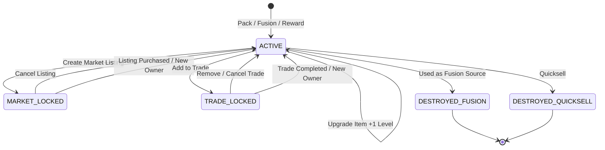

# 05 — Card Lifecycle

> **Project:** SlamDunk  
> **Purpose:** Define Card Instance creation, ownership, locking, destruction, and audit rules.

---

## 1. Core Principle

A Card Instance is a persistent game asset with a unique identity.

It may change owner, level, or availability state, but its historical identity must remain auditable.

A Card Instance should not be physically deleted when it is fused or quicksold.

---

## 2. Card Template vs Card Instance

```text
Card Template
= shared card definition

Card Instance
= one individually owned/minted card
```

Example:

```text
Stephen Curry — Goat
```

may be one Card Template.

Instances:

```text
Curry #1 Lv3
Curry #2 Lv5
Curry #3 Lv1
```

are different Card Instances.

---

## 3. Card Creation Sources

A Card Instance may be created by:

```text
PACK
FUSION
ADMIN_GRANT     future/admin only
EVENT_REWARD    future
```

Every creation must:

1. allocate a new serial number;
2. increment `total_minted`;
3. increment `current_circulation`;
4. create Card Instance;
5. create initial ownership history where applicable.

---

## 4. Serial Number Rule

Serial numbers are monotonically increasing per Card Template.

They are never reused.

Example:

```text
#1
#2
#3
#4
#5
```

If #2 and #4 are destroyed through Fusion:

```text
#2 → destroyed
#4 → destroyed
```

the next minted card is:

```text
#6
```

not #2 or #4.

---

## 5. Lifecycle Status

Recommended persistent lifecycle status:

```text
ACTIVE
DESTROYED_FUSION
DESTROYED_QUICKSELL
```

Market and Trade are not destruction states.

They are temporary availability locks.

---

## 6. Availability Locks

An ACTIVE card may additionally be:

```text
market_locked = true
trade_locked = true
```

A card must never be simultaneously market-locked and trade-locked.

Recommended invariant:

```text
market_locked XOR trade_locked
```

Both false means the card is normally available.

---

## 7. Card Lifecycle Diagram



`MARKET_LOCKED` and `TRADE_LOCKED` are conceptual states implemented by active relations/locks rather than destructive status values.

---

## 8. Pack Mint Lifecycle

```text
Pack selection confirmed
        ↓
Lock / validate pack session
        ↓
Determine selected Card Template
        ↓
Roll weighted initial Level 1–5 from the source's configured Level table
        ↓
Allocate next serial
        ↓
Create Card Instance
        ↓
status = ACTIVE
        ↓
Create ownership history
        ↓
Update mint/circulation counters
```

The two unselected pack candidates are not Card Instances unless product design explicitly decides to mint all candidates.

Recommended MVP behavior:

```text
Only the selected card is minted.
```

This avoids meaningless serial/circulation inflation.

---

## 9. Ownership Transfer Lifecycle

Ownership may change because of:

```text
Market Purchase
Direct Trade
Admin Transfer
```

Transfer must:

```text
validate current owner
validate card ACTIVE
validate appropriate lock
change owner
increment ownership_cycles
create ownership history
```

The card keeps:

```text
same card_instance_id
same serial_number
same card_level
same template
```

---

## 10. Fusion Lifecycle

### Preconditions

Both source cards:

```text
have same owner
have same card_template_id
status = ACTIVE
not market locked
not trade locked
are distinct Card Instances
```

### Calculation

```text
result_level = min(levelA + levelB, 5)
```

### Example

```text
Curry #2 Lv2
+
Curry #4 Lv4
↓
Curry #6 Lv5
```

### Atomic lifecycle

```text
Lock source cards
        ↓
Validate sources
        ↓
Allocate new serial
        ↓
Mark source A DESTROYED_FUSION
Mark source B DESTROYED_FUSION
        ↓
current_circulation -= 2
        ↓
Mint result card
current_circulation += 1
total_minted += 1
        ↓
Create Fusion record
Create ownership record
        ↓
Commit
```

Net circulation change:

```text
-1
```

---

## 11. Upgrade Item Lifecycle

Upgrade Item modifies the same Card Instance.

### Preconditions

```text
card owned by player
status = ACTIVE
not locked
card_level < 5
player owns Upgrade Item
```

### Result

```text
new_level = old_level + 1
```

Maximum:

```text
5
```

Unlike Fusion:

```text
same card_instance_id
same serial_number
```

remain.

The consumed item must be recorded.

---

## 12. Market Lifecycle

Creating a listing:

```text
ACTIVE Card
    ↓
validate ownership
    ↓
create ACTIVE listing
    ↓
market_lock = true
```

Cancel:

```text
listing → CANCELLED
market_lock = false
```

Purchase:

```text
listing locked
        ↓
payment + ownership transfer
        ↓
listing → SOLD
market_lock = false
new owner assigned
```

A market-locked card cannot be:

```text
fused
quicksold
directly traded
listed again
```

Battle eligibility while listed is **TBD**.

---

## 13. Direct Trade Lifecycle

A new Trade begins in an invitation phase. Both participants must accept before
Cards can be added or Gold can be offered.

When a card is added to an active trade:

```text
trade_lock = true
```

While trade-locked it cannot be:

```text
listed on market
fused
quicksold
added to another trade
```

Trade completion:

```text
all offers locked
        ↓
all confirmations valid
        ↓
ownership transfers
        ↓
trade locks cleared
        ↓
trade COMPLETED
```

Any offer modification invalidates confirmations.

---

## 14. Quicksell Lifecycle

### Preconditions

```text
owned by player
status = ACTIVE
not market locked
not trade locked
```

### Result

```text
Card → DESTROYED_QUICKSELL
current_circulation -= 1
Gold and Shards credited
transaction recorded
```

Quicksell must be atomic.

---

## 15. Destroyed Card Rules

Destroyed cards:

```text
cannot return to ACTIVE
cannot be traded
cannot be listed
cannot battle
cannot be upgraded
cannot be used again in Fusion
```

They remain queryable for:

```text
audit
ownership history
fusion provenance
economy investigation
collector history
```

---

## 16. Card Value Rule

Low serial number does **not** create an explicit gameplay bonus.

Official game value is primarily driven by:

```text
base stats
traits
trait tiers
card level
rarity / scarcity context
```

Players may still personally value low serial numbers on the market, but SlamDunk does not add a direct stat bonus for them.

---

## 17. Invariants

The system must enforce:

```text
Card level between 1 and 5
Destroyed card cannot be ACTIVE
Destroyed card cannot have active market/trade lock
Only ACTIVE cards can change owner
Only one active Market Listing per card
Only one active Trade participation per card
Serial number never reused
Fusion sources cannot equal each other
Fusion sources must share Card Template
```

---

## 18. Audit Requirements

Every important Card lifecycle event should be traceable by:

```text
card_instance_id
event type
actor/player
reference transaction
timestamp
```

High-value events:

```text
MINT
TRANSFER
MARKET_LIST
MARKET_SALE
TRADE
FUSION
UPGRADE_ITEM
QUICKSELL
ADMIN_ACTION
```
